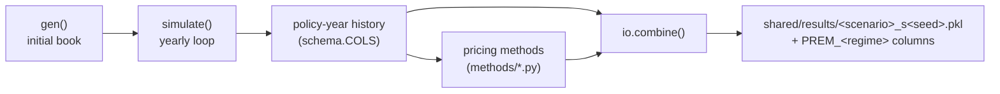

# How the simulation works

This page explains the engine function by function. Everything lives in
`simulation/voltvision/simulate.py` unless stated otherwise.

## Big picture

One run = one scenario × one seed. The engine builds a book and evolves it for
`n_years`, recording **one row per policy-year** (including lapsers). Claims are
simulated once and later shared by every pricing method — **premium is never
simulated**.



## Determinism and draw order

- Every call to `simulate()` creates **one local RNG**
  (`numpy.random.default_rng(seed)`); there are no globals.
- The **order of RNG calls is part of the contract**: the same seed and config
  must reproduce the same book, so helper order and float-expression grouping in
  `simulate.py` are fixed. Reordering draws changes every downstream number —
  treat it as a model change, not a refactor.
- JSON key order matters where dictionaries feed draws: fleet mix is drawn ICE
  then EV; the peril list (`severity.perils`) defines peril-draw order.

## Book generation — `gen()`

`gen(cfg, vehicle_pct, seed, year, prefix, n)` assembles the starting book (and
every entrant cohort). It calls these steps in order:

| Step function | What it draws | Template keys |
|---|---|---|
| `_draw_product_mix()` | `COVERAGE_TYPE`, `VEHICLE_TYPE`, `REGION` — three categorical draws | `coverage_ramp.from`, the scenario's vehicle mix, `region_pct` |
| `_draw_sum_assured()` | `SUM_ASSURED` per fuel type: log-normal(median, spread), rounded to RM1,000 | `sa_stats` |
| `_draw_engine_bands()` | `ENGINE_CAPACITY` band (used by the tariff lookup) | `engine_bands`, `engine_weights` |
| `_draw_driver_profile()` | generation band, exact `DRIVER_AGE` inside the band, `DRIVER_GENDER` | `generation_pct`, `age_bands`, `gender_pct` |
| `_draw_car_age()` | `CAR_AGE`: band median ± noise, clipped 0–10 | `car_age_median`, `car_age_sigma` |
| `_draw_risk_flags()` | `FLOOD_RISK`, `THEFT_RISK` booleans per region; the template stores P(True), drawn as `random() > 1 − p` per region in first-appearance order | `risk_flags` |
| `_draw_ncd_entry()` | starting `NCD_YEARS` mix → `NCD_LEVEL` tier lookup | `ncd_entry`, `ncd_table` |
| `_draw_telematics()` | raw harsh-braking / speeding / night-share draws → blended, min-maxed, clipped score 20–100 → rank-mapped `BEHAVIOR_RISK` in [lo, hi]. The observable `telematics_score` is kept for EV only (set `NaN` for ICE); `BEHAVIOR_RISK` stays for every vehicle | `telematics`, `behavior_risk` |
| `_make_policy_ids()` | deterministic `POLID` = prefix + year + sequence | — |

`BEHAVIOR_RISK` is latent (never priced). Its observable proxy is
`telematics_score` — the device signal used by the telematics method, and it is
**EV-only** (ICE rows are `NaN`; the telematics method prices ICE with a
no-score, GLM-shaped model).

## The claim-rate model — `claim_lambda()`

Per policy, the Poisson rate (claims per year) is log-linear:

```
log(rate) = claim_frequency_base
          + young_adult · 1[Young Adults]        (0.40)
          + senior      · 1[Seniors]             (0.26)
          + young_male  · 1[Young × Male]        (0.05)
          + ev          · 1[EV]                  (0.05)
          + flood       · 1[FLOOD_RISK]          (0.20)   ← only in flood years
          + theft       · 1[THEFT_RISK]          (0.10)
          + log(BEHAVIOR_RISK)
          + car_age_per_year · CAR_AGE           (0.03)
          + ncd_per_year     · NCD_YEARS         (−0.05)
rate = exp(log rate) × coverage_multiplier × frequency_intensity   (Comp 1.00 / TPFT 0.60 / TPO 0.45; intensity 1.0)
```

All coefficients are template keys (`frequency`, `claim_frequency_base`).
`frequency_intensity` is a linear stress multiplier on the whole rate (`λ = λ_base
× intensity`, default 1.0). The flood term is multiplied by the year's
flood-event marker (below).

`loading()` is the tariff-style combined loading used by the tariff method:
driver band (1.20 / 1.05 / 1.00 / 1.05) × (1 + 0.03 × min(CAR_AGE, 10)).

## Severity and settlement

### `draw_perils(coverage, count, rng, cfg)`

One uniform vector vs the cumulative peril mix — the claim's peril per row.
`peril_dist` maps each coverage to its mix; `severity.perils` fixes draw order.

### `severity_params(perils, sum_assured, cfg)`

Builds per-claim Gamma **shape / scale / cap** arrays from
`severity.specs.<peril>`:

| Field | Meaning |
|---|---|
| `shape` | Gamma shape (lower = heavier tail) |
| `scale` | RM number **or** `{"sa_fraction", "min", "max"}` = `clip(SA × fraction, min, max)` |
| `cap` | `null` (uncapped), RM number, or `"sum_assured"` |
| `severity_multiplier` | global multiplier on every peril's scale |

### `settle_claims(claim_amounts, perils, sum_assured, young, cfg, rng, year)`

Turns gross draws into payouts with one simple rule per own-damage peril:

| Peril | Rule |
|---|---|
| Theft (`payout: total`) | payout = SA − excess, always (stolen car = total loss) |
| Fire (`payout: mixed`) | with prob `total_loss_prob` (0.60) total loss; else partial × inflation − excess |
| AD (`payout: mixed`) | with prob `total_loss_prob` (0.08) total loss; else partial × inflation − excess |

- `excess`: RM400 standard; AD uses `young_excess` (RM1,500) for Young Adults.
- a partial at or below its excess is **not reported** (payout 0).
- partial amounts are inflated by `(1 + severity_inflation)^(SIM_YEAR − cohort_year)`;
  total-loss payouts use the (depreciated) sum assured.
- caps still apply from `severity_params`; TPBI/TPPD/Windscreen keep pure Gamma
  payouts (no excess).

### Vectorized aggregation in `_add_severity()`

Claimants are exploded into one row per claim (`np.repeat`), perils and amounts
are drawn in one shot, amounts are regrouped per policy with `np.add.at`, and
per-policy peril strings are joined with `/` (e.g. `AD/Theft`).

## The yearly loop — `simulate()`

| Order | Step function | What happens |
|---|---|---|
| 0 | `_draw_flood_events()` | one Bernoulli per region-year (`flood_event_prob`); stored as `{year: {region: bool}}`. Each loop year writes a `_FLOOD_YEAR` marker column, so the flood loading in `claim_lambda()` only bites in event years |
| 1 | `_age_inforce()` | in-force policies +1 year of driver and car age; band upgrades at 27/45/65; when `sa_depreciation > 0`, sum assured is marked down at renewal (floor `sa_min`) |
| 2 | `_add_frequency()` | snapshot `NCD_LEVEL_PRICED` **before** the year's claims (priced NCD lags one year), compute `CLAIM_LAMBDA`, draw Poisson `CLAIM_COUNT` |
| 3 | `_add_severity()` | per-claim peril → Gamma → settlement → per-policy totals (see above) |
| 4 | `_add_retention()` | `RENEWAL_PROB = base 0.82` + claim/clean delta (−0.25 / +0.05) + NCD bonuses (≥3: +0.15, ≥2: +0.08) + telematics bonus (≥80: up to +0.10, ≥60: +0.03) − behaviour penalty (0.05 × (BR − 1)), clipped [0.10, 0.95]; renewal draw |
| 5 | `_update_ncd()` | claim → `NCD_YEARS = 0`; clean year → +1; `NCD_LEVEL` tier lookup |
| 6 | record | the full year state is appended in `schema.COLS` order (lapsers included, so retention stays measurable) |
| 7 | `_add_entrants()` | next year's new business: `count = n × entrant_frac × (1 + entrant_growth)^t`; fleet mix from `entrant_vehicle_mix()` (linear `vehicle_ramp`) and coverage mix from `coverage_mix_at()` (linear `coverage_ramp`); entrant RNG seed = `seed + k + 1` |

### `entrant_vehicle_mix(cfg, base_mix, year)` and `coverage_mix_at(cfg, year)`

Shared ramp machinery: `ramp_progress(cfg, year)` gives the linear 0→1 position
across `cohort_year … cohort_year + n_years − 1` and `blend_mix(start, end, t)`
does the componentwise blend, so both ramps behave identically. The base mix is
`vehicle_ramp.from` / `coverage_ramp.from` (whole book). With a `to` mix,
entrant shares drift `from`→`to`; no `to` → entrants keep the base mix.
Existing policies never change fuel type or coverage.

### `normalize_mix(mix)`

Validates an allocation dict and drops zero weights — so `{"ICE": 0, "EV": 1.0}`
behaves exactly like a single-fuel book (same RNG stream), and a ramped mix that
reaches 0 or 1 collapses cleanly.

## Entry points

| Function | Use |
|---|---|
| `simulate_book(cfg, vehicle, seed, n_years, cache=False)` | gen + simulate in one call; `cache=True` (used by ML training) reuses identical books, capped at 2 in memory |
| `run_scenarios()` (`voltvision/runner.py`) | the loop over scenarios × seeds: build cfg → simulate → price → combine → save + manifest |

## What happens after the book (pricing side)

Short version — full contract in [Pricing](pricing.md):

1. `ensure_core_methods()` imports every module in `voltvision/methods/`
   (each registers itself on import).
2. `resolve_cards(cfg, scenario)` merges each method's declared defaults with
   template and scenario `pricing` overrides.
3. `price_many(book, regimes, cards, cfg, base_cfg)` calls each method's
   `price_<name>(book, card, cfg, base_cfg)` → one `PREM_<regime>` column.
4. ML methods build their training book via `ml.training_history()` — from the
   **base template world**, one window earlier, never from the scenario's DGP.
5. `io.combine()` writes the single result file; `io.update_manifest()` records
   cfg + cards + metrics.

## Reproducibility rules for contributors

- Do not reorder RNG calls or regroup float expressions — the parity gate pins
  hashes, and historical comparability depends on them.
- Assumption changes go to `base_template.json` / scenarios; mechanic changes go
  to `simulate.py`; premium math goes to `voltvision/methods/*.py`.
- After engine or method changes: run `python run_scenarios.py --quick`, then a
  full sweep, and update the parity numbers in this repo's docs if intentional.
