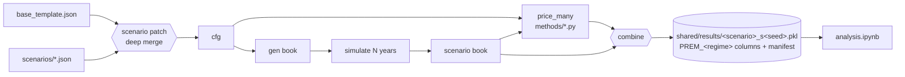

# MET-X — VoltVision motor simulator

Synthetic Malaysian motor insurance book and a **premium-independent simulation
engine** with a **black-box pricing layer**, built for IFoA VoltVision
(pre/post-detariffication context).

Two systems, deliberately separated:

1. **Simulation** — `simulation/voltvision/simulate.py` generates policy books and
   evolves them over `n_years` (frequency → peril → severity → settlement →
   retention → NCD). Claims are shared by every pricing method; **premium is
   never simulated**.
2. **Pricing** — black-box methods (`simulation/voltvision/methods/*.py`) behind
   one standard interface: `func(book, card, cfg, base_cfg) -> book + FINAL_PREMIUM_SST`.
   The system never knows what a method's parameters mean — each method declares
   its own rate card.

## Repo map (monorepo)

| Path | Component |
|---|---|
| `simulation/` | the project (engine, pricing methods, runner, notebooks, results) |
| `docs/` | this documentation site (MkDocs Material) |
| `AGENT.md` | engineering rules, parity gate, boundaries |

The claim model is **calibrated to Malaysian industry experience** (PIAM 2025
sources): total-loss settlement for theft/fire/own-damage, excesses, flood as
event years, claim inflation and SA depreciation. `analysis.ipynb` §10 scores
every run against sourced benchmarks — the default book passes 6/6.

## Where to go next

- **[Getting started](getting-started.md)** — install, first run, results.
- **[How the simulation works](how-the-simulation-works.md)** — every engine
  function explained.
- **[Assumptions](assumptions.md)** — the single source of truth (`base_template.json`).
- **[Scenarios](scenarios.md)** — flat patches, seeds, vehicle ramps, growth.
- **[Claim settlement & realism](claim-model.md)** — payout rules and industry checks.
- **[Pricing](pricing.md)** — the rate-card contract, the loader, adding a method.
- **[Analysis](analysis.md)** — `analysis.ipynb` sections.
- **[Benchmarks & sources](sources.md)** — sourced industry targets and citations.
- **[Development](development.md)** — monorepo conventions and parity discipline.
